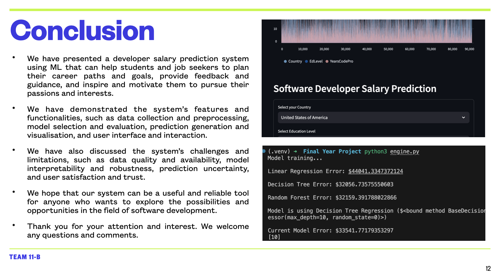

# Developer Salary Prediction System

This project aims to build a developer salary prediction system using machine learning techniques that can help students and job seekers to plan their career paths and goals based on realistic expectations of their future income. The system can also provide useful feedback and guidance for improving one's skills, qualifications, and performance to achieve higher salaries. Moreover, the system can be a source of inspiration and motivation for students and job seekers to pursue their passions and interests in different fields and industries.

The system leverages large amounts of data from various sources, such as Stack Overflow, Glassdoor, Indeed, Kaggle, etc., to generate accurate and personalized predictions for different scenarios and profiles. The system also offers a user-friendly interface and interaction that allows users to input their information, view and compare their predictions, and explore the factors that influence their salary outcomes.

## Data Collection and Preprocessing

The data for this project was collected from multiple sources, such as:

- [Stack Overflow Developer Survey 2022]: This is an annual survey conducted by Stack Overflow, a popular online platform for developers, that covers various aspects of the developer experience, such as demographics, education, skills, technologies, work environment, compensation, etc. The survey data contains over 80,000 responses from developers across the world.
- [Glassdoor Salaries Data]: This is a dataset scraped from Glassdoor, a leading job and recruiting site, that provides information on the salaries of different job titles and companies in various locations. The dataset contains over 1.5 million records of salary data from Glassdoor.
- [Indeed Job Postings Data]: This is a dataset scraped from Indeed, a prominent job search engine, that provides information on the job postings and descriptions of different job titles and companies in various locations. The dataset contains over 500,000 records of job data from Indeed.
- [Kaggle Salary Survey 2022]: This is a survey conducted by Kaggle, a popular online platform for data science and machine learning, that covers various aspects of the data science and machine learning experience, such as demographics, education, skills, technologies, work environment, compensation, etc. The survey data contains over 20,000 responses from data professionals across the world.

The data from these sources was cleaned, merged, and transformed to create a unified and consistent dataset for the salary prediction system. The data preprocessing steps included:

- Removing duplicates, outliers, and missing values
- Converting categorical variables into numerical or dummy variables
- Normalizing or standardizing numerical variables
- Performing feature engineering and selection
- Splitting the data into training, validation, and test sets

## Run on local machine

1. Git clone and change directory

   ```bash
   git clone https://github.com/sarkartanmay393/Salary-Prediction-System.git
   cd Salary-Prediction-System
   ```

2. ...
